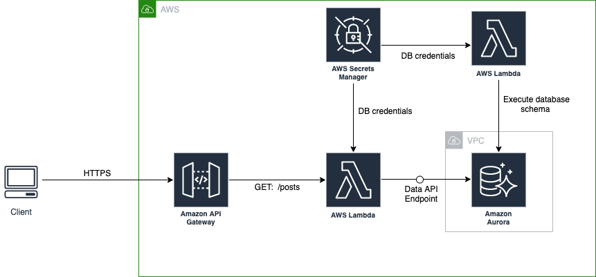

# Serverless Aurora App with Database Migration

This project shows how to build a fully Serverless backend on AWS and how you can approach  database schema migration in [ Amazon Aurora Serverless](https://aws.amazon.com/rds/aurora/serverless/) (MySQL)  using [Amazon API Gateway](https://aws.amazon.com/api-gateway/), [AWS Lambda](https://aws.amazon.com/lambda/), and Python CDK. 

## How to Run

1. **Clone the code repository**

```
git clone git@github.com:abiodunjames/aws-serverless-aurora.git
```


2. **Create a virtualenv**

To create the virtualenv it assumes that there is a `python3` (or `python` for Windows) executable in your path with access to the `venv` package. If for any reason the automatic creation of the virtualenv fails, you can create the virtualenv manually.

To manually create a virtualenv on MacOS and Linux:

```
$ python3 -m venv .venv
```

After the init process completes and the virtualenv is created, you can use the following step to activate your virtualenv.

```
$ source .venv/bin/activate
```

If you are a Windows platform, you would activate the virtualenv like this:

```
% .venv\Scripts\activate.bat
```

3. **Once the virtualenv is activated, you can install the required dependencies.**

```
$ pip install -r requirements.txt
```

At this point you can now synthesize the CloudFormation template for this code.

```
$ cdk synth
```

To add additional dependencies, for example other CDK libraries, just add them to your `setup.py` file and rerun the `pip install -r requirements.txt` command.

4. **Now you deploy the application** 

```
cdk deploy
```

On successful deployment, you can browse the endpoint at:
```
curl https://xxxxxx.execute-api.xxxxxx.amazonaws.com/prod/posts 
```

```
curl https://hkgpg3z1xd.execute-api.eu-west-1.amazonaws.com/prod/posts

{"statusCode": 200, "body": [[{"longValue": 1}, {"stringValue": "344d117ea9f1"}, {"stringValue": "A serverless blogpost with Aurora"}, {"stringValue": "serverless-aurora"}, {"stringValue": "This is the description of the post"}, {"longValue": 0}, {"isNull": true}, {"isNull": true}]]}%     

```
##  Solution




#### Database Schema Migration 

The code leverages custom resources with a lambda function to run database migration schema after provisioning an aurora instannce.

The SQL scripts are packaged into lambda layer, available to the executing function in the "/opt" directory.


#### Config

The `config.py`  contains route definition and how http endpoints map to each lambda function. It's a dictionary object that looks like this:

```python
routes = {
    "posts": [
        {"method": "GET", "function": "get_posts"},
        {"method": "POST", "function": "create_posts"},
    ],
}
```

The idea behind this is to make the relationship between paths, methods and functions configurable.

#### Functions

Lambda functions are defined in in this directory.  All functions should use `handler` as nme. 

```
def handler(event, context):
		.......
```

#### Scripts

SQL scripts are located in the `scripts/schema` directory.  It contains the schema of your database.  You may version migration scripts. For example:

```
v1.sql
v2.sql
v3.sql
...
```
### References
 * [Using Aurora Serverless and the Data API](https://github.com/aws-samples/aws-aurora-serverless-data-api-sam)
 * [AWS CDK Examples (Custom Resource)](https://github.com/aws-samples/aws-cdk-examples/tree/master/python/custom-resource)

## Known Issues

Custom resource functions are not run on subsequent deploys if no modifications were made to the custom resource. 

As you develop, you might need to modify your SQL scripts during development and expect the lambda function to apply the new changes during the next deployment. Unfortunately, this does not work as you may have expected.   My thought on this is similar to what [Tom](https://github.com/tommedema) wrote [here](https://github.com/serverless/serverless/issues/4483).

> Cloudformation creates an internal state, and then if the resource is already created once, it won't be created again unless you previously deleted it. If you then change the resource parameters, it will be run again with the Update event.RequestType.

However, there is a workaround suggested in this [thread](https://github.com/serverless/serverless/issues/4483 ) to fix this temporarily.
